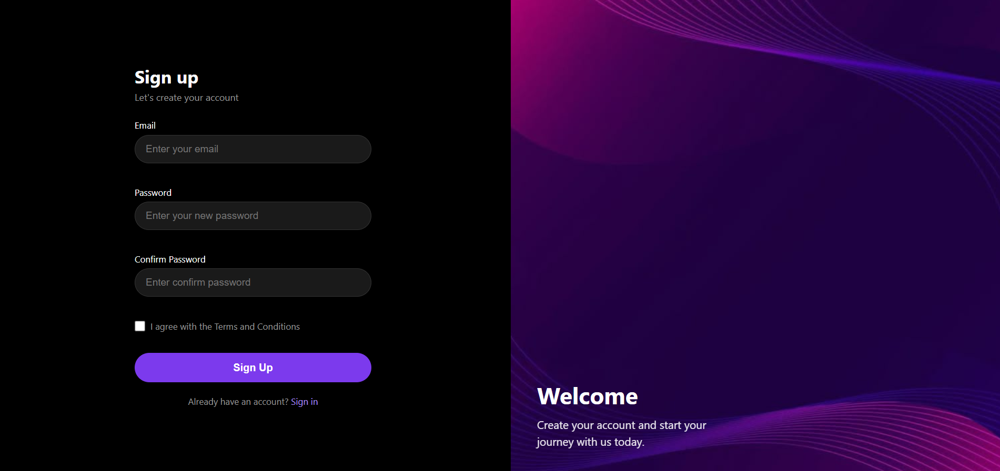
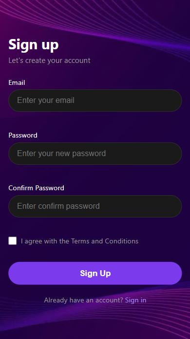

# Sign Up Page

A responsive and modern Sign Up page built with **HTML, CSS, and JavaScript**.

## 🔗 Live Demo

[View Live Demo](https://elenahedayat.github.io/signup-page/)

## 📸 Screenshot

🖥️ Desktop


📱 Mobile


## ✨ Features

* Responsive design for different screen sizes
* Email validation
* Password validation
* Confirm password validation
* Terms and Conditions checkbox validation
* Real-time error messages
* Success message after successful form submission
* Modern dark UI with purple accents

## 🛠️ Technologies

* HTML5
* CSS3
* JavaScript

## 📁 Project Structure

```text
signup-page/
├── index.html
├── style.css
├── script.js
└── image.png
```

## 🚀 How to Run

1. Clone or download the repository.
2. Open `index.html` in your browser.

No additional installation or dependencies are required.

## 📝 Notes

This project is a front-end implementation of a Sign Up page.
The form validation is handled with JavaScript and does not connect to a real backend or database.

## 👩‍💻 Author

**Elena Hedayat**
